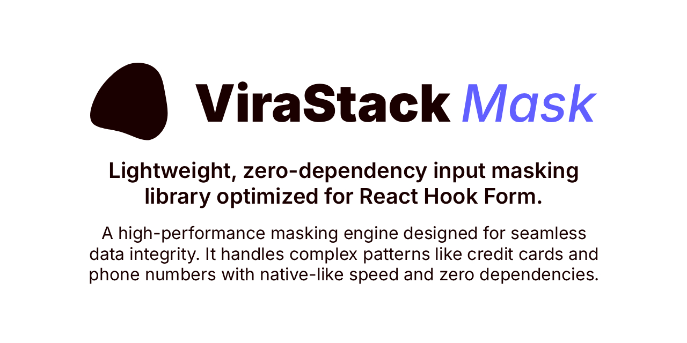

<div align="center">
  
</div>

<br />

<div align="center">
  <a href="https://www.npmjs.com/package/@virastack/input-mask">
    
  </a>
  <a href="https://www.npmjs.com/package/@virastack/input-mask">
    
  </a>
  <a href="https://bundlephobia.com/package/@virastack/input-mask">
    
  </a>
</div>

<br />

# ViraStack Input Mask

The lightweight standard for input formatting and state synchronization in React.

- 🚀 **Ultra-lightweight:** Less than 5KB minified & zipped.
- ⚛️ **React-First:** Seamless integration with React Hook Form.
- 🛡️ **Type-Safe:** Built with TypeScript for an excellent developer experience.
- 🧠 **Smart Presets:** Built-in masks for credit cards, phones, currency, and more.

### [Read the docs →](https://virastack.com/mask)

## Quick Start

```bash
npm install @virastack/input-mask
```

```tsx
import { useForm } from 'react-hook-form';
import { useViraMask } from '@virastack/input-mask';

function App() {
  const form = useForm();
  
  const { phone } = useViraMask({
    form,
    schema: {
      phone: 'phone'
    }
  });

  return (
    <form>
      <input {...phone} placeholder="(555) 555 55 55" />
    </form>
  );
}
```

## Explore the ViraStack Ecosystem

### Projects

- [**Next.js Boilerplate**](https://github.com/virastack/nextjs-boilerplate) - Production-ready Next.js 16+ starter template built with Tailwind CSS 4 and TypeScript.
- [**AI Rules**](https://github.com/virastack/ai-rules) - AI-native architecture kit and high-discipline protocols for modern React applications.
- [**Input Mask**](https://github.com/virastack/input-mask) - Lightweight, zero-dependency input masking library optimized for React Hook Form.
- [**Password Toggle**](https://github.com/virastack/password-toggle) - Fully accessible and highly customizable password visibility hook for React.
- [**Modern Web in 3 Minutes**](https://github.com/virastack/modern-web-in-3-minutes) - Master modern web development standards in just 3 minutes.

### 🚧 Coming Soon

- [**Start (CLI)**](https://github.com/virastack/cli) - Automated scaffolding tool to initialize and scale high-discipline ViraStack architectures.
- [**TanStack Boilerplate**](https://github.com/virastack/tanstack-boilerplate) - Production-ready TanStack Start starter template built with Tailwind CSS 4 and TypeScript.
- [**Standards**](https://github.com/virastack/standards) - A unified suite of ESLint, Prettier, and architectural rules to enforce absolute code integrity.
- [**Error Guard**](https://github.com/virastack/error-guard) - Pro-grade error handling and smart recovery protocols for zero-friction React environments.

... and more at [**virastack.com**](https://virastack.com)

## License

Licensed under the <a href="https://github.com/virastack/input-mask/blob/main/LICENSE">MIT License</a>.

## Maintainer

A project by [**Ömer Gülçiçek**](https://omergulcicek.com)

[](https://github.com/omergulcicek)